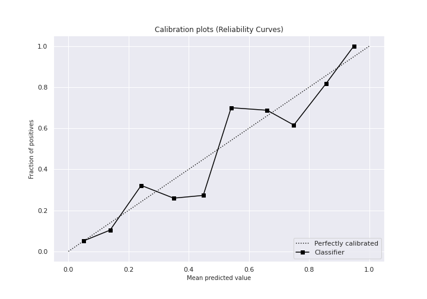
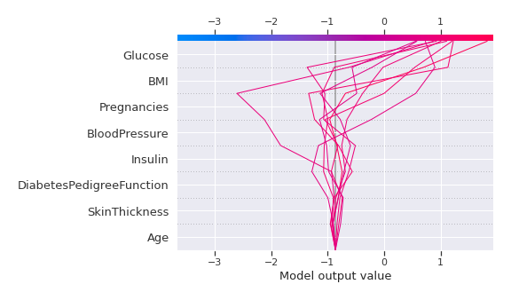

# Summary of 3_Linear

[<< Go back](../README.md)

## Logistic Regression (Linear)
- **n_jobs**: -1
- **explain_level**: 2

## Validation
 - **validation_type**: split
 - **train_ratio**: 0.75
 - **shuffle**: True
 - **stratify**: True

## Optimized metric
logloss

## Training time

3.7 seconds

## Metric details
|           |    score |   threshold |
|:----------|---------:|------------:|
| logloss   | 0.472213 | nan         |
| auc       | 0.834269 | nan         |
| f1        | 0.70922  |   0.378746  |
| accuracy  | 0.796875 |   0.509251  |
| precision | 0.933333 |   0.815084  |
| recall    | 1        |   0.0219264 |
| mcc       | 0.54282  |   0.378746  |

## Metric details with threshold from accuracy metric
|           |    score |   threshold |
|:----------|---------:|------------:|
| logloss   | 0.472213 |  nan        |
| auc       | 0.834269 |  nan        |
| f1        | 0.688    |    0.509251 |
| accuracy  | 0.796875 |    0.509251 |
| precision | 0.741379 |    0.509251 |
| recall    | 0.641791 |    0.509251 |
| mcc       | 0.541655 |    0.509251 |

## Confusion matrix (at threshold=0.509251)
|              |   Predicted as 0 |   Predicted as 1 |
|:-------------|-----------------:|-----------------:|
| Labeled as 0 |              110 |               15 |
| Labeled as 1 |               24 |               43 |

## Learning curves

## Coefficients
| feature                  |   Learner_1 |
|:-------------------------|------------:|
| Glucose                  |   1.06864   |
| DiabetesPedigreeFunction |   0.807144  |
| BMI                      |   0.779419  |
| Pregnancies              |   0.424415  |
| Age                      |   0.094639  |
| SkinThickness            |   0.0786974 |
| Insulin                  |  -0.168165  |
| BloodPressure            |  -0.277507  |
| intercept                |  -1.25571   |

## Permutation-based Importance

## Confusion Matrix

## Normalized Confusion Matrix

## ROC Curve

## Kolmogorov-Smirnov Statistic

## Precision-Recall Curve

## Calibration Curve

## Cumulative Gains Curve

## Lift Curve

## SHAP Importance

## SHAP Dependence plots

### Dependence (Fold 1)

## SHAP Decision plots

### Top-10 Worst decisions for class 0 (Fold 1)

### Top-10 Best decisions for class 0 (Fold 1)

### Top-10 Worst decisions for class 1 (Fold 1)

### Top-10 Best decisions for class 1 (Fold 1)

[<< Go back](../README.md)
