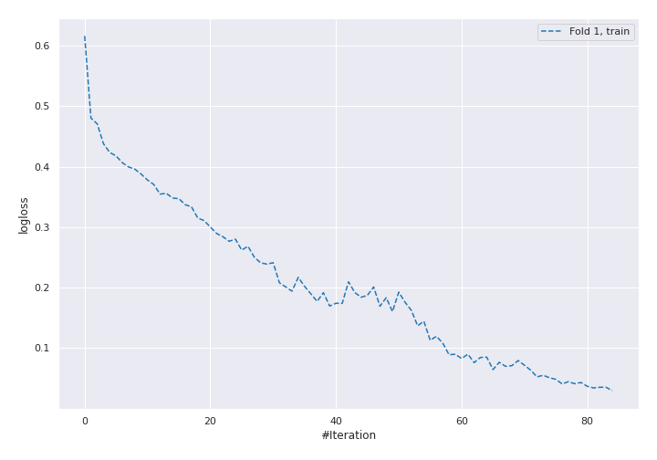
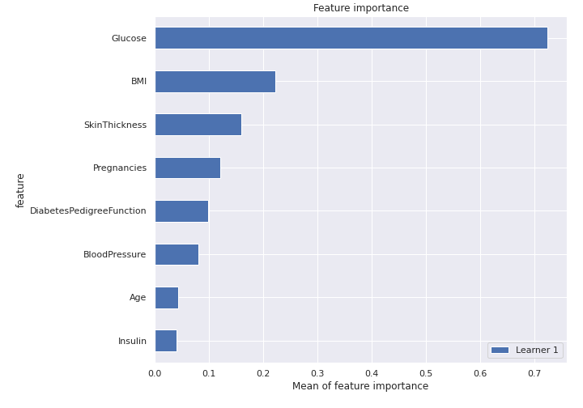
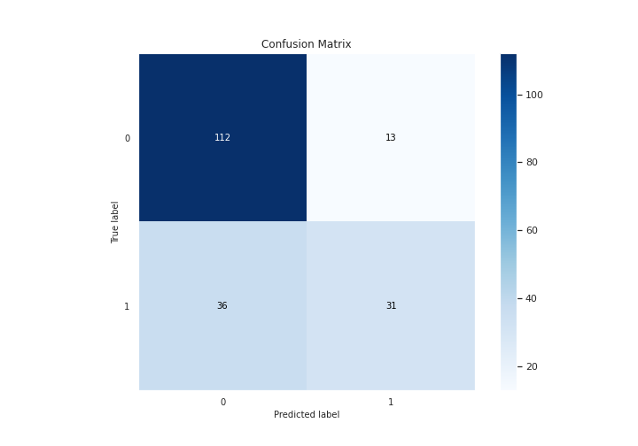
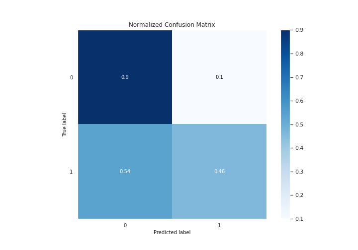
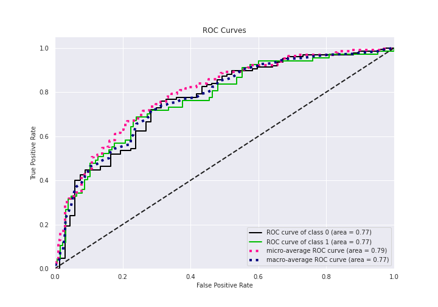
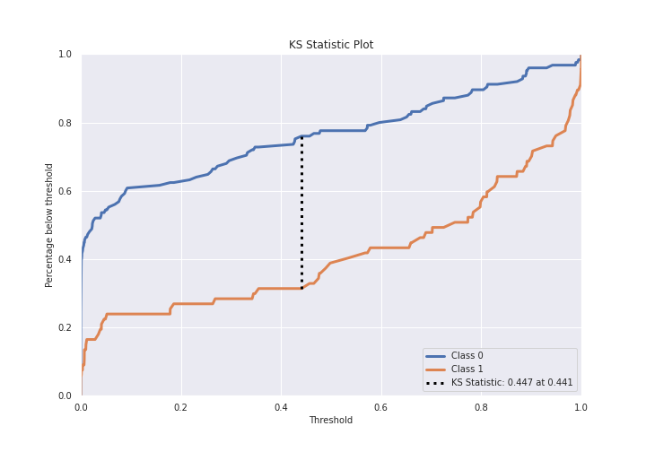
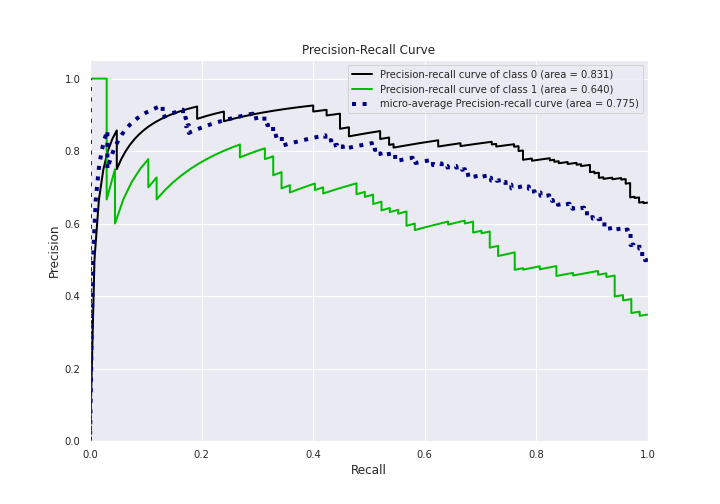
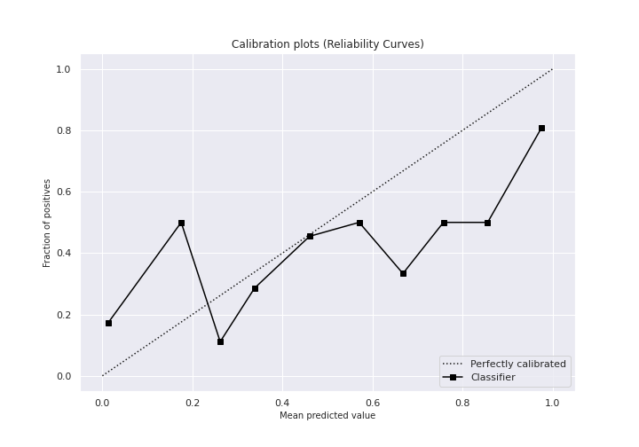
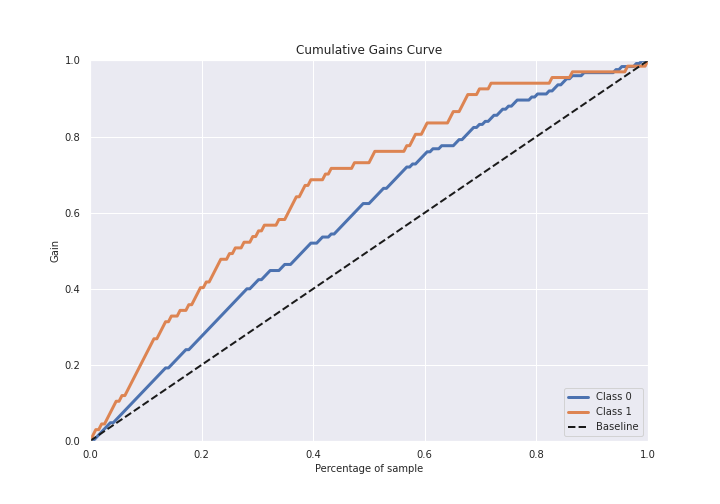
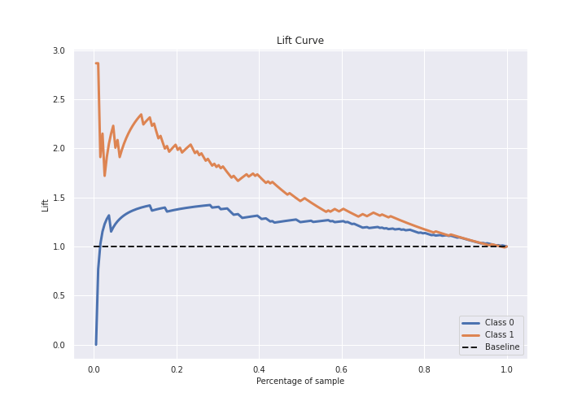

# Summary of 5_Default_NeuralNetwork

[<< Go back](../README.md)

## Neural Network
- **n_jobs**: -1
- **dense_1_size**: 32
- **dense_2_size**: 16
- **learning_rate**: 0.05
- **explain_level**: 2

## Validation
 - **validation_type**: split
 - **train_ratio**: 0.75
 - **shuffle**: True
 - **stratify**: True

## Optimized metric
logloss

## Training time

1.8 seconds

## Metric details
|           |    score |     threshold |
|:----------|---------:|--------------:|
| logloss   | 0.978159 | nan           |
| auc       | 0.766925 | nan           |
| f1        | 0.643357 |   0.452262    |
| accuracy  | 0.744792 |   0.792876    |
| precision | 1        |   0.999819    |
| recall    | 1        |   7.68869e-19 |
| mcc       | 0.435255 |   0.452262    |

## Metric details with threshold from accuracy metric
|           |    score |   threshold |
|:----------|---------:|------------:|
| logloss   | 0.978159 |  nan        |
| auc       | 0.766925 |  nan        |
| f1        | 0.558559 |    0.792876 |
| accuracy  | 0.744792 |    0.792876 |
| precision | 0.704545 |    0.792876 |
| recall    | 0.462687 |    0.792876 |
| mcc       | 0.406771 |    0.792876 |

## Confusion matrix (at threshold=0.792876)
|              |   Predicted as 0 |   Predicted as 1 |
|:-------------|-----------------:|-----------------:|
| Labeled as 0 |              112 |               13 |
| Labeled as 1 |               36 |               31 |

## Learning curves

## Permutation-based Importance

## Confusion Matrix

## Normalized Confusion Matrix

## ROC Curve

## Kolmogorov-Smirnov Statistic

## Precision-Recall Curve

## Calibration Curve

## Cumulative Gains Curve

## Lift Curve

[<< Go back](../README.md)
