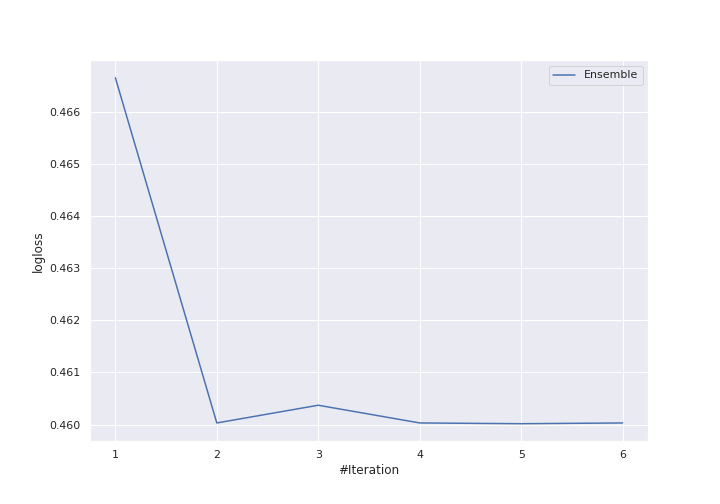
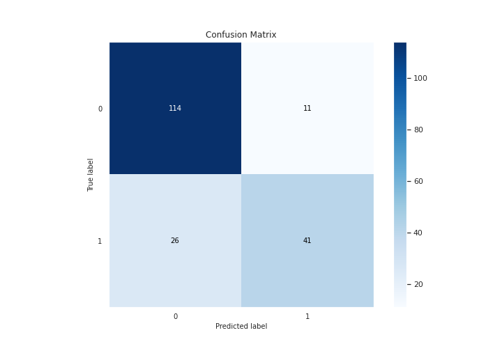
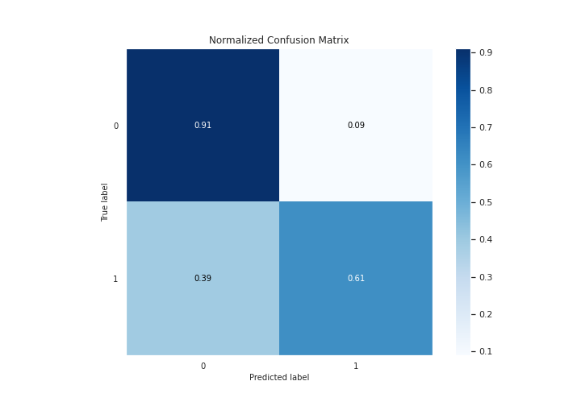
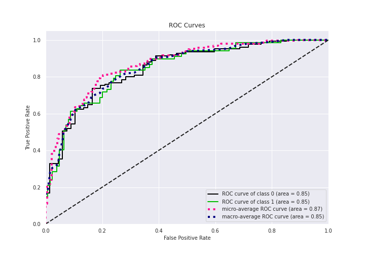
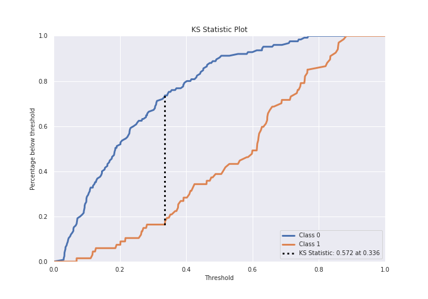
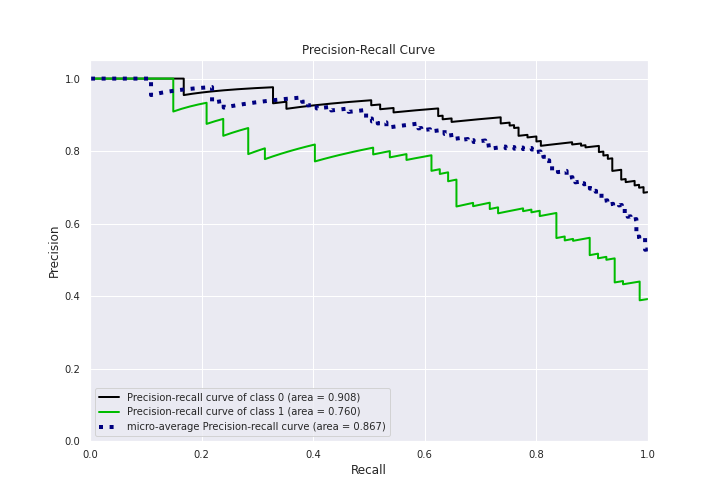
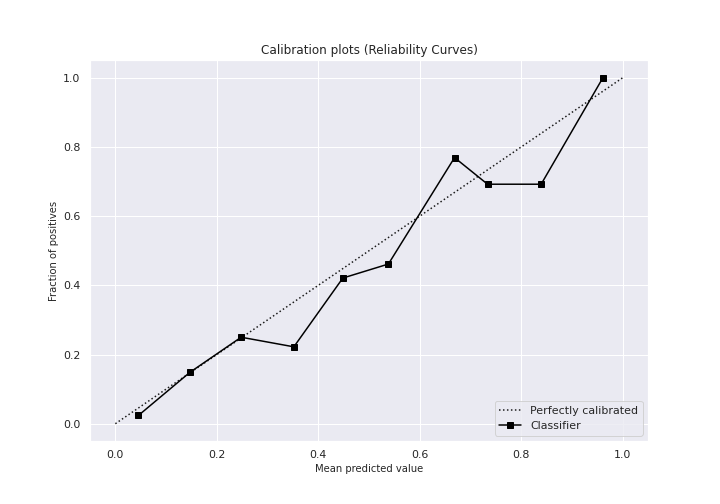
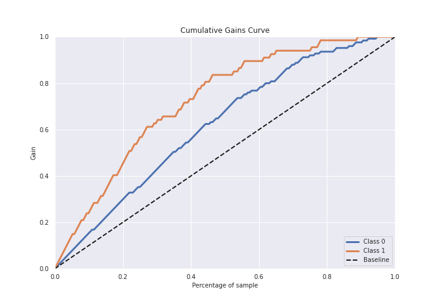

# Summary of Ensemble

[<< Go back](../README.md)

## Ensemble structure
| Model                  |   Weight |
|:-----------------------|---------:|
| 3_Linear               |        2 |
| 6_Default_RandomForest |        3 |

## Metric details
|           |    score |   threshold |
|:----------|---------:|------------:|
| logloss   | 0.460017 | nan         |
| auc       | 0.845851 | nan         |
| f1        | 0.710526 |   0.349297  |
| accuracy  | 0.807292 |   0.511537  |
| precision | 1        |   0.841041  |
| recall    | 1        |   0.0274029 |
| mcc       | 0.561964 |   0.511537  |

## Metric details with threshold from accuracy metric
|           |    score |   threshold |
|:----------|---------:|------------:|
| logloss   | 0.460017 |  nan        |
| auc       | 0.845851 |  nan        |
| f1        | 0.689076 |    0.511537 |
| accuracy  | 0.807292 |    0.511537 |
| precision | 0.788462 |    0.511537 |
| recall    | 0.61194  |    0.511537 |
| mcc       | 0.561964 |    0.511537 |

## Confusion matrix (at threshold=0.511537)
|              |   Predicted as 0 |   Predicted as 1 |
|:-------------|-----------------:|-----------------:|
| Labeled as 0 |              114 |               11 |
| Labeled as 1 |               26 |               41 |

## Learning curves

## Confusion Matrix

## Normalized Confusion Matrix

## ROC Curve

## Kolmogorov-Smirnov Statistic

## Precision-Recall Curve

## Calibration Curve

## Cumulative Gains Curve

## Lift Curve

[<< Go back](../README.md)
