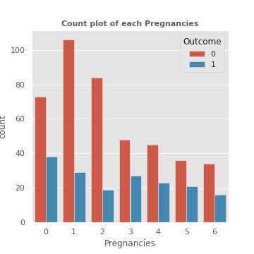
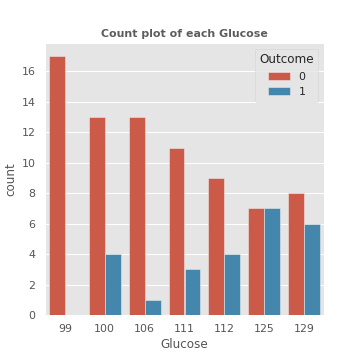
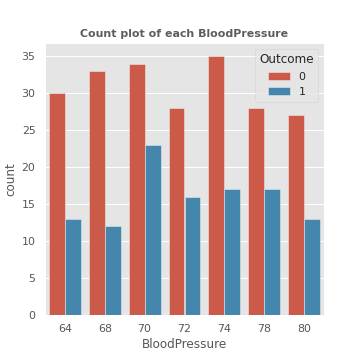
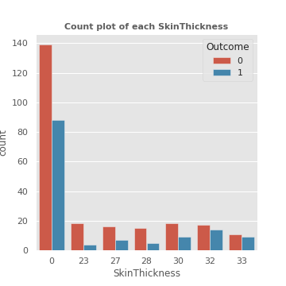
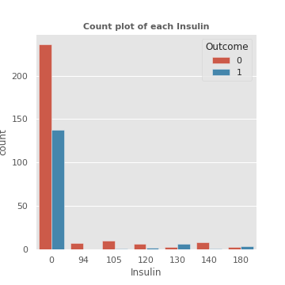
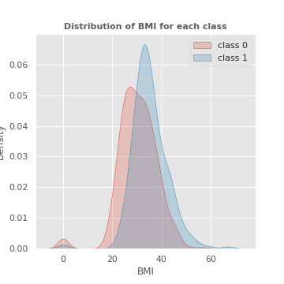
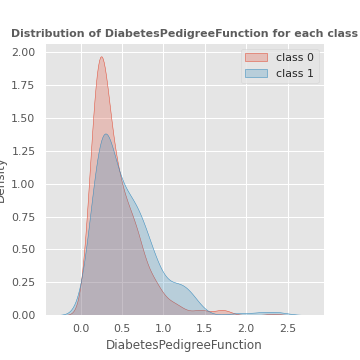
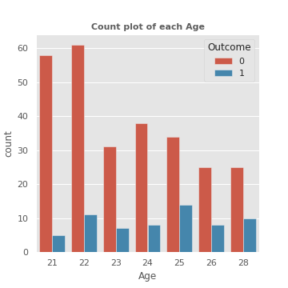
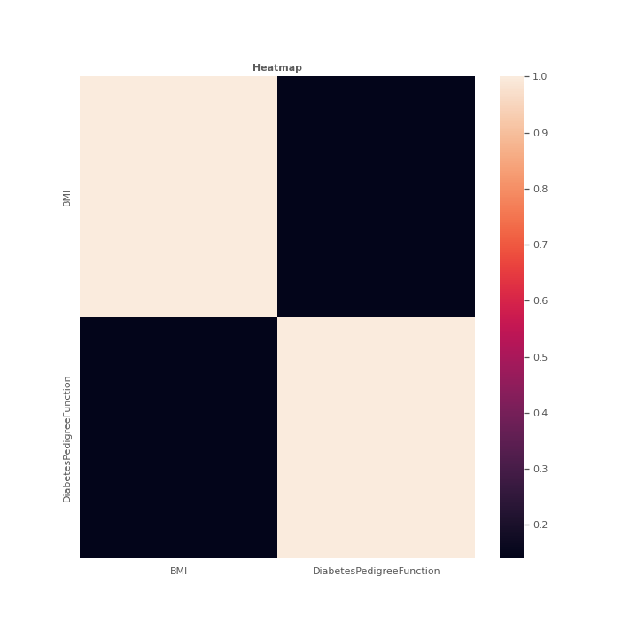

## Bivariate analysis of Pregnancies feature with target

------------------------------------------------------
## Bivariate analysis of Glucose feature with target

------------------------------------------------------
## Bivariate analysis of BloodPressure feature with target

------------------------------------------------------
## Bivariate analysis of SkinThickness feature with target

------------------------------------------------------
## Bivariate analysis of Insulin feature with target

------------------------------------------------------
## Bivariate analysis of BMI feature with target

------------------------------------------------------
## Bivariate analysis of DiabetesPedigreeFunction feature with target

------------------------------------------------------
## Bivariate analysis of Age feature with target

------------------------------------------------------
## Heatmap

------------------------------------------------------
